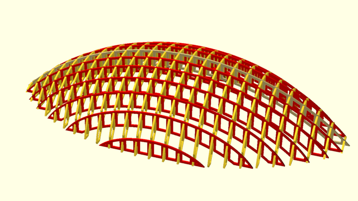
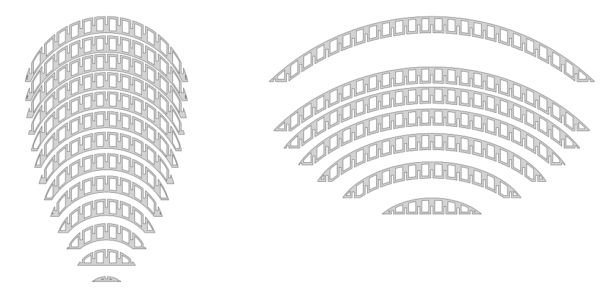

# Lamperl

Prototype for a small Python Script to generate lampshades.  
The script generates a dxf with all rib variants to assemble the generated lamphade  
### 3D-View:  

### 2D-view for laser-cutting:  

### Status is in development  

### ToDos
Code refactoring is necessary - especially in areas of big cutouts
- [ ] new implementation as general function for circualar and non-circualr ribs
- [ ] new shapes for cutouts (circles, ellipses, rounded or chamfered corners, diagonal bracings, ...)
- [ ] take care about very small edges - which might get instable

possible new features:
- [ ] "low poly" variant with straight lines between the rib crossing points
- [ ] GUI for configuration and preview of result 
- [ ] generate laser-cutter ready dxf for given material sheet
- [ ] add chamfers or fillets in the cutout corners

